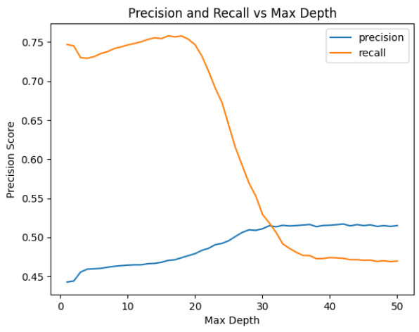
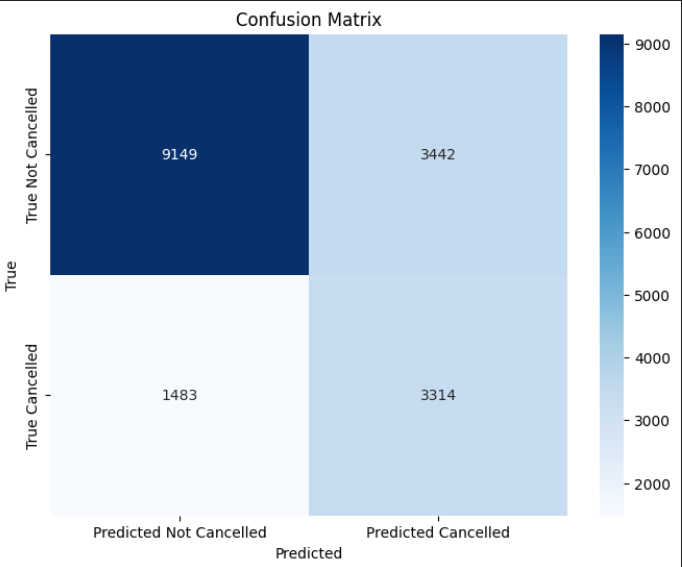
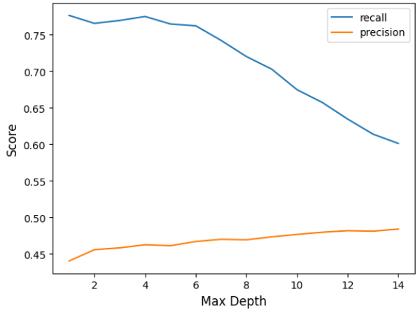
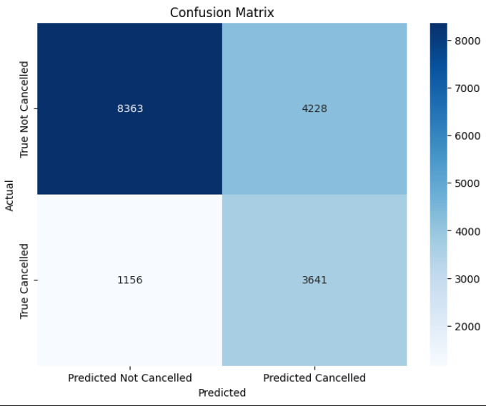

# hotel_cancellation_prediction_capstone

## problem statement
Hotel cancellation becoming more unpredictable, due to increasing cancellation rates, net revenue shows slow growth. Predicting cancellation can mitigate the slow revenue growth and help achieve better operational efficiency, which will also improve hotel overall revenue performance. 

## original data sets
- H1.csv
- H2.csv  

## approach (refer to ipynb files in chronological order)
1. import and concate H1 and H2 
2. data cleaning: cast all datatypes accordingly and address all duplicated records
3. outlier checks and EDA
4. dashboarding with Tableau
5. KNN modelling with no data imbalance handling
6. KNN modelling with imbalance handling
7. log regression with weight class balanced
8. log regression with custom weight class

## dashboard on booking details

## K nearest neighbours model (with imbalance handling on dataset)

## log regression with custom weight class

## (UPDATED)Testing with Random Forest (refer to 4_3 ipynb)
- evaluation turn out better
- Achieve improved recall to 71% with 49% precision
- Logistic Regression only achieve 60% recall with 49% precision

## random forest evaluation
- precision and recall behaviour vs max depth

- confusion matrix

## hyperparameter for random forest as below
rf = RandomForestClassifier(
    n_estimators=200,          
    max_depth=22,            
    min_samples_split=2,       
    min_samples_leaf=1,        
    max_features='sqrt',      
    class_weight='balanced', 
    random_state=42
)

## XGBoost evaluation (refer to 4_4 ipynb)
- precision and recall behaviour vs max depth

- confusion matrix

## hyperparameter for XGBoost as below
xgb = XGBClassifier(  
    objective='binary:logistic',  
    n_estimators=400,  
    learning_rate=0.3,  
    max_depth=5,  
    random_state=42,  
    eval_metric='logloss',  
    reg_lambda = 10,  
    scale_pos_weight=scale_pos_weight  
)

## summarised evalutaion
KNN             - acc:0.69, recall: 0.60, precision:0.45  
log regression  - acc:0.71, recall: 0.60, precision:0.49   
random forest   - acc:0.71, recall: 0.71, precision:0.49   
xgboost         - acc:0.69, recall: 0.76, precision:0.46   

## conclusion
Best prediction model using random forest. Random forest achieved the best balance between precision and recall. Achieving 49% precision and 71% recall.  

In the hotel industry, it is equally important to prioritise precision as false alarms(predicting cancellation wrongly) will lead to costlier damage which includes reputational damage. While opeartional effeciency is important to improve hotel revenue, reputation of the hotel should not be compromised. Hotel room overbooking strategy needs to be executed delicately. 

## Recommendation to hotel management: 
- only allow half of the total predicted cancelled rooms from the ML model to be overbooked due to model 49% precision
- this is to keep operational risks under control and maintain low potential operational cost contributed by customers that were predicted to cancel but do turn up (avoid unneccesary room upgrades or client dissatisfaction)
- only apply prediction model for less premium room, to avoid huge reputation damage and monetory loss

