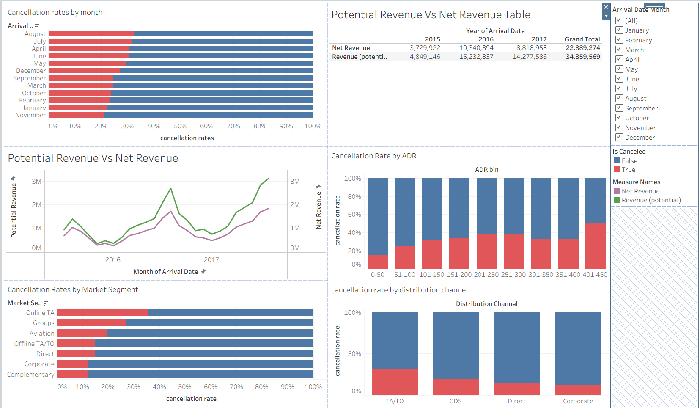
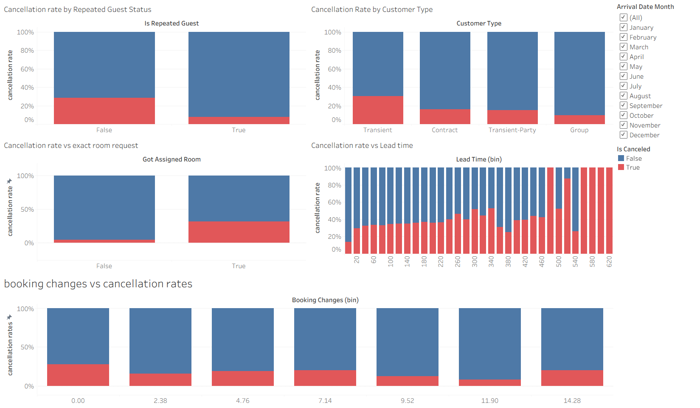
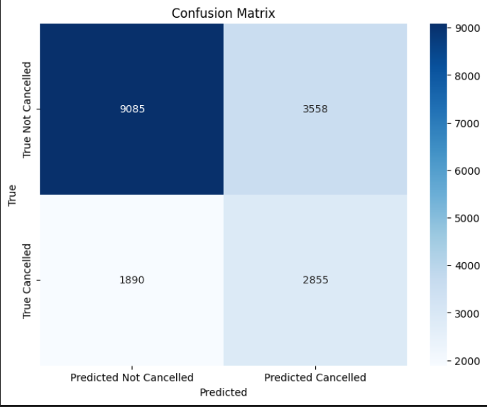
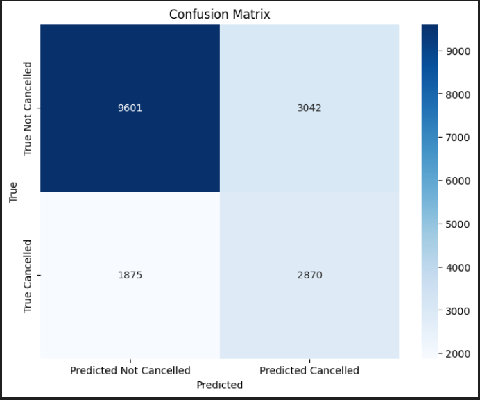

# hotel_cancellation_prediction_capstone

## problem statement
Hotel cancellation becoming more unpredictable, due to increasing cancellation rates, net revenue shows slow growth. Predicting cancellation can mitigate the slow revenue growth and help achieve better operational efficiency, which will also improve hotel overall revenue performance. 

## original data sets
- H1.csv
- H2.csv  

## approach (refer to ipynb files in chronological order)
1. import and concate H1 and H2 
2. data cleaning: cast all datatypes accordingly and address all duplicated records
3. outlier checks and EDA
4. dashboarding with Tableau
5. KNN modelling with no data imbalance handling
6. KNN modelling with imbalance handling
7. log regression with weight class balanced
8. log regression with custom weight class

## dashboard on booking details

## K nearest neighbours model (with imbalance handling on dataset)

## log regression with custom weight class

## conclusion
Best prediction model using log regression. Both KNN and log regression has recall score of 0.60 but log regression achieved higher precision at 49% while KNN model achieved 45%. 

In the hotel industry, it is equally important to prioritise precision as false alarms(predicting cancellation wrongly) will lead to costlier damage which includes reputational damage. While opeartional effeciency is important to improve hotel revenue, reputation of the hotel should not be compromised. Hotel room overbooking strategy needs to be executed delicately. 

## Recommendation to hotel management: 
- only allow half of the total predicted cancelled rooms from the ML model to be overbooked due to model 49% precision
- this is to control any operational challenge and cost customers that were predicted to cancel do turn up (avoid unneccesary room upgrades or client dissatisfaction)
- only predict for less premium room, avoid huge reputation damage